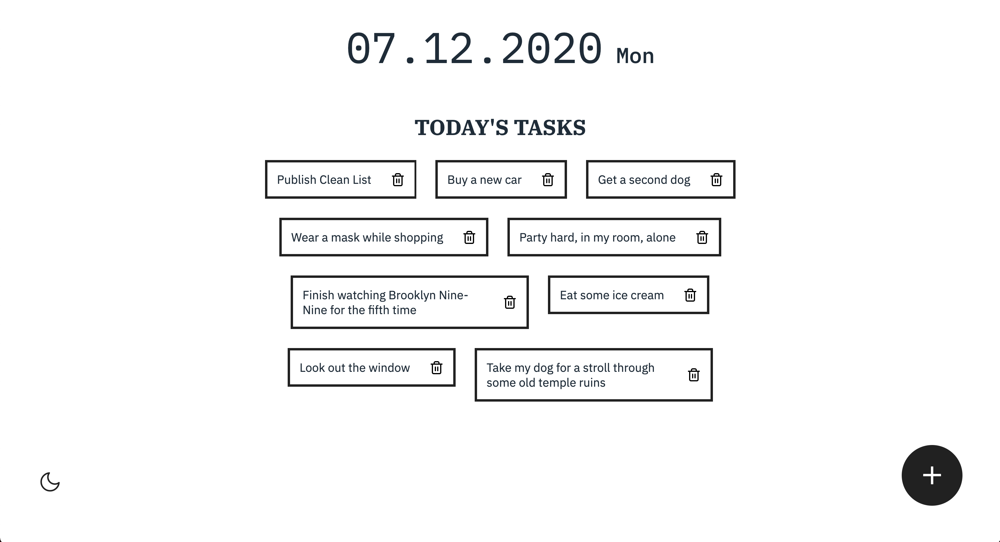
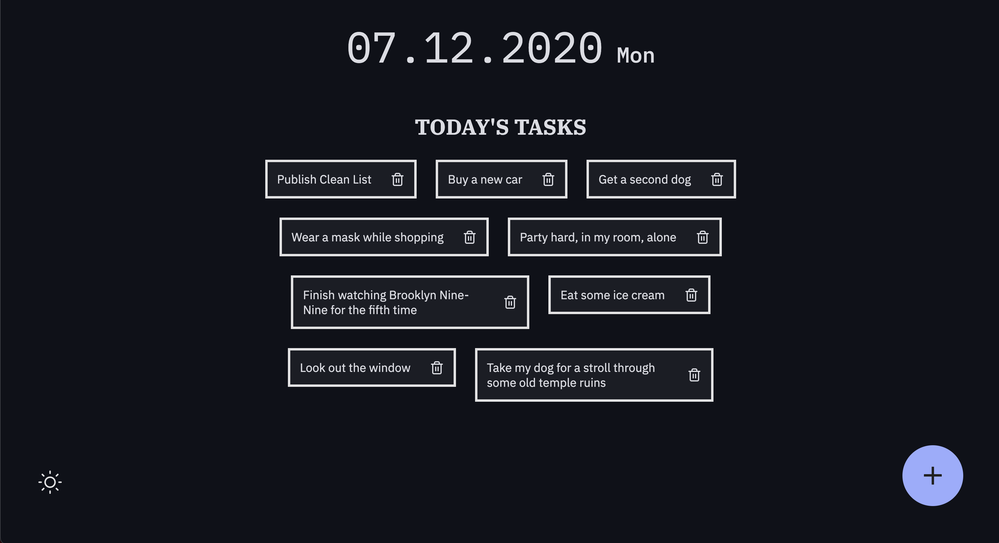

# Clean List

## A simple and clean to-do list for all your important tasks

### Why use this?

If you are anything like me, you are probably tired of all the over-the-top
to-do lists out there.
Why do I need 100 features that I never use anyway? You just want something
simple that **does the job**, and **looks good** doing it.

### Enter *CleanList*

This website functions exactly how you would expect. You press a button, enter
your task information, and the task information gets added to a list. There's an
optional dark mode, some nice animations, and *that's it*. No messing with
different settings, having to go through a tutorial, navigating through different folders, or
information overload.
*Just a **clean list***.

### Screenshots

#### Light mode (standard)

#### Dark mode

#### Gif demo

### Got some feedback?

If you have any suggestions or other concerns, please contact me using this email:
maximilianvons@gmail.com
